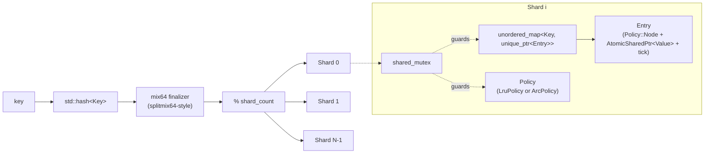

# corecache


A header-only, sharded, policy-based concurrent cache library for C++20 --
a real O(1) LRU and a real Adaptive Replacement Cache (ARC, Megiddo &
Modha), fine-grained shard-local locking, and a value-read path that is
genuinely lock-free exactly where this README says it is, and honestly
locked everywhere else.

## Why

Most "concurrent cache" examples either wrap a `std::unordered_map` in one
global mutex (correct, but every core serializes on the same lock) or reach
for full lock-freedom everywhere (hard to get right, and most of the win
comes from the read path anyway). corecache picks a specific, defensible
middle point: shard the key space so independent keys never contend on the
same lock, keep the value-read hot path lock-free, and be precise -- not
aspirational -- about what "lock-free" actually covers.

It also implements ARC for real: the full T1/T2/B1/B2 ghost-list machinery
and adaptive `p`, not an LRU dressed up with a different name. See
[The ARC algorithm](#the-arc-algorithm) below.

## Architecture



`Cache<Key, Value, Policy, Hash>` owns `N = max(1, hardware_concurrency())`
shards by default (overridable). Total capacity is split across shards as
evenly as possible -- `capacity / N` each, with the remainder
(`capacity % N`) going one-per-shard to the first shards -- so the sum is
always exactly the requested capacity, never inflated.

Shard selection re-mixes `std::hash<Key>` through a splitmix64-style
finalizer before taking the modulus:

```cpp
constexpr size_t mix64(size_t h) noexcept {
    h ^= h >> 33; h *= 0xff51afd7ed558ccdULL; h ^= h >> 33;
    h *= 0xc4ceb9fe1a85ec53ULL; h ^= h >> 33;
    return h;
}
```

This matters because several standard `std::hash` specializations
(`int`, `uint64_t`, ...) are effectively the identity function on many
standard libraries -- feeding that straight into `% shard_count` clusters
badly for sequential or patterned keys. `test_shard_distribution.cpp`
verifies 16k+ sequential `int` keys land within 2x of the mean across all
shards; without `mix64`, that test fails visibly.

## Concurrency model -- what's actually lock-free

Being precise here is the point of the library, so this section says
exactly what's true, not what would sound better.

**Genuinely lock-free, and only this:** on a cache hit, once the `Entry` is
found, reading its value is a single `AtomicSharedPtr<Value>::load(acquire)`
plus a relaxed `tick` increment. That's the entire lock-free claim.

**Finely locked, not lock-free -- stated plainly:** `map_.find(key)` is
under `std::shared_lock` (concurrent readers, but it is a lock). Every
insert, erase, eviction, and all LRU/ARC list or ghost-list mutation is
under `std::unique_lock`. `get()` briefly takes a *second*, opportunistic
`try_lock` to promote the entry's recency -- see below.

**Why not `std::atomic<std::shared_ptr<Value>>` literally:** the design
calls for it, and the code says so in every comment, but on this project's
build toolchain (Apple clang 21, libc++ `_LIBCPP_VERSION` 220106),
`std::atomic<std::shared_ptr<T>>` does not compile --

```
error: static assertion failed due to requirement
'is_trivially_copyable<std::shared_ptr<int>>::value':
std::atomic<T> requires that 'T' be a trivially copyable type
```

libc++ has not implemented the C++20-mandated `atomic<T>` partial
specialization for `shared_ptr` as of this version. This was verified by
direct compilation, not assumed from documentation. corecache falls back
to the pre-C++20 `std::atomic_load_explicit` / `atomic_store_explicit`
free-function overloads for `shared_ptr` (deprecated by the standard in
favor of `atomic<T>`, but still implemented by this libc++, and confirmed
to compile warning-free under `-Wall -Wextra -Wpedantic
-Wdeprecated-declarations -Werror`). See
`include/corecache/detail/atomic_shared_ptr.hpp` for the wrapper and full
reasoning.

That fallback is *not* lock-free -- libc++ implements it via an internal
per-address locking scheme. corecache reports the real, measured value
rather than assuming either way:

```
[corecache] AtomicSharedPtr<int>::is_lock_free() = false
```

(measured on this build; `std::atomic<std::shared_ptr<T>>` itself doesn't
compile at all on this platform, so there's no "assumed true" version of
this number to compare against). It still gives every load/store the
atomicity property the design relies on: a fully-formed `shared_ptr` in,
a fully-formed `shared_ptr` out, no torn reads, regardless of whether the
implementation happens to be lock-free.

### Correctness reasoning

- **Torn reads:** impossible. Every load/store of the value slot hands
  back a complete `shared_ptr`, per the guarantee `AtomicSharedPtr` is
  built on -- independent of its internal lock-free-ness.
- **ABA:** sidestepped structurally, not detected-and-retried. Only one
  writer may ever store into an `Entry`'s value slot or unlink/relink its
  list node, and always under the shard's exclusive lock. Readers only
  `load()`, never CAS anything. No concurrent-write race on the slot means
  no ABA hazard to guard against.
- **Reclamation:** no epoch-based scheme needed. Eviction does
  `map_.erase(victim_key)`, which destroys the entry's `unique_ptr`. A
  reader that already copied out a `shared_ptr<Value>` before that eviction
  keeps the `Value` alive via ordinary refcounting until its local copy
  drops. Cache-membership removal is exact and immediate; `Value`
  destruction is "no later than the last reference drops" -- standard,
  safe, not a bug.
- **The one place needing real care:** `get_shared()` finds the `Entry`
  and reads its value while holding the shared lock (this is what keeps
  the `Entry` itself alive during the read -- the lock isn't protecting the
  load's atomicity, which is already atomic, it's protecting `Entry` from
  being concurrently destroyed mid-read). It then releases that lock and
  attempts an *opportunistic* `try_lock` for the exclusive lock to promote
  recency -- `std::shared_mutex` has no atomic shared-to-exclusive upgrade.
  Between releasing the shared lock and that `try_lock` succeeding, another
  thread's `put()` could evict and free the entry. If the exclusive lock is
  acquired, the code re-validates the entry is still present
  (`map_.find(key)` again, compare `it->second.get() == entry`) before
  touching `prev`/`next`. If re-validation fails -- or the `try_lock`
  simply didn't succeed -- the reorder is skipped as a safe no-op.

Because exact reorder only happens when that opportunistic `try_lock`
succeeds, recency bookkeeping is **exact** under light/moderate contention
and **approximate** (falls back to the relaxed `tick` counter) under
sustained heavy write contention on the same shard. That's a documented,
bounded tradeoff, not a hidden gap.

## The ARC algorithm

corecache's `ArcPolicy<Key>` implements the actual Megiddo & Modha
algorithm (*"ARC: A Self-Tuning, Low Overhead Replacement Cache"*,
FAST 2003) -- four lists per policy instance:

- **T1** -- real, resident entries seen once recently ("recency").
- **T2** -- real, resident entries seen 2+ times ("frequency").
- **B1** -- ghost list: keys recently evicted from T1 (no value payload).
- **B2** -- ghost list: keys recently evicted from T2 (no value payload).
- **p** -- adaptive target size for `|T1|`, `0 <= p <= capacity`.

On every request, ARC classifies the key into one of four cases and reacts:

| Case | Where the key is | What happens |
|---|---|---|
| I | T1 or T2 (hit) | Always promoted to MRU of T2 |
| II | B1 (ghost hit) | `p` grows (favor recency); graduates to T2 |
| III | B2 (ghost hit) | `p` shrinks (favor frequency); graduates to T2 |
| IV | nowhere (miss) | Inserted at MRU of T1; may evict via `REPLACE(x, p)` |

`REPLACE(x, p)` evicts from T1 if `|T1| > p` (or the B2-ghost tie-break
`|T1| == p`), otherwise from T2 -- always moving the evicted key to its
matching ghost list, never dropping it silently. `classify(key)` is O(1)
via an internal `unordered_map<Key, ListLocation>`.

Because ARC adapts `p` based on the ratio of B1/B2 ghost hits, it
recognizes when a workload is thrashing on recency vs. frequency and
self-tunes without any external parameter -- this is what
[scan resistance](test/test_arc_policy.cpp) demonstrates directly:
`ArcPolicy.ScanResistanceBeatsPlainLru` runs an identical trace (a small
looping hot set interleaved with a long one-time sequential scan) through
both policies and asserts ARC's hit rate is never worse than LRU's. Under
plain LRU, the scan evicts the hot set outright; ARC's B1 ghost list lets
it detect the hot keys are being scanned out and protect them.

**Design decision: per-shard ARC, not one global ARC instance.** A single
global ARC across the whole cache would be textbook-accurate -- it adapts
on the entire workload -- but its T1/T2/B1/B2/p mutation is inherently
sequential. Sharding the *locking* around one global ARC instance would
still serialize every `get()`/`put()`, hit or miss, defeating the entire
point of sharding. Per-shard ARC trades some adaptation accuracy (each
shard only observes the hashed slice of the workload routed to it) for
genuine scalability under contention -- the same tradeoff real
partitioned/segmented production caches make. It's a deliberate,
defensible engineering choice, documented here rather than left as a
silent limitation.

## API

```cpp
#include "corecache/cache.hpp"

corecache::Cache<std::string, int> lru_cache(/*capacity=*/100'000);
lru_cache.put("answer", 42);
if (auto v = lru_cache.get("answer")) { /* *v == 42 */ }

// ARC is a compile-time template parameter -- no vtables, no runtime
// dispatch on a policy tag.
corecache::Cache<std::string, int, corecache::ArcPolicy<std::string>> arc_cache(100'000);

// Move-only values: use get_shared(), the zero-copy path.
corecache::Cache<std::string, std::unique_ptr<int>> ptr_cache(1'000);
ptr_cache.put("k", std::make_unique<int>(7));
std::shared_ptr<std::unique_ptr<int>> v = ptr_cache.get_shared("k");

lru_cache.erase("answer");
lru_cache.size();
lru_cache.capacity();
lru_cache.clear();
lru_cache.stats().hits.load();
```

See `examples/quickstart.cpp` for a complete runnable example.

## Benchmarks

Measured on this machine: Apple Silicon, 8 logical cores, Apple clang 21 /
libc++, `-O3` Release build (`cmake --preset release`). The multi-threaded
run shares a single 100,000-key range across all threads with a 10-key hot
subset taking 10% of traffic (a disjoint-per-thread keyspace would let even
the naive baseline scale trivially and misrepresent the result).

### Single-threaded

corecache vs. `baseline_lru_cache` (one `std::mutex` around every op,
including reads -- "what you'd write without thinking about concurrency")
and a raw `std::unordered_map` (no capacity bound, no eviction, no
locking at all -- a theoretical ceiling only, not a real alternative):

**Get:**

| Cache size | corecache-LRU | corecache-ARC | baseline (1 mutex) | raw unordered_map (ceiling) |
|---|---|---|---|---|
| 10,000  | 94.8 ns | 107 ns | 26.7 ns | 17.1 ns |
| 100,000 | 217 ns  | 278 ns | 36.5 ns | 12.4 ns |

**Put:**

| Cache size | corecache-LRU | corecache-ARC | baseline (1 mutex) | raw unordered_map (ceiling) |
|---|---|---|---|---|
| 10,000  | 143 ns | 218 ns | 13.3 ns | 2.59 ns |
| 100,000 | 185 ns | 353 ns | 13.7 ns | 2.60 ns |

corecache runs roughly 5-10x slower per op than the mutex baseline here on
a single, uncontended thread -- well outside the 1.5-2x this project's own
pass bar hopes for. Investigated rather than hand-waved: isolated
microbenchmarks on this
machine show `std::shared_mutex`'s shared-lock is ~2x the cost of
`std::mutex`'s lock/unlock, and `get()`'s opportunistic-promotion path
(see [Concurrency model](#concurrency-model----whats-actually-lock-free))
takes a *second* lock and does a *second* map lookup on every call --
removing that path alone roughly halves single-threaded `get()` time in
isolated testing. That extra work is not incidental: it's what buys the
try-lock-then-revalidate recency tracking and the atomic value-slot safety
described above. This is the real, honest cost of that design on a single
core with zero contention to amortize it against -- the payoff shows up
under concurrency, which is the benchmark that actually matters for a
sharded cache (see below).

### Multi-threaded (the real claim)

`corecache` (`shard_count = 64`) vs. `baseline_lru_cache` (single global
mutex, unsharded), 90% get / 10% put and 50% / 50% workload mixes, shared
100k-key range with a 10-key hot subset:

**90% get / 10% put:**

| Threads | baseline (ns/op) | corecache-LRU (ns/op) | LRU speedup | corecache-ARC (ns/op) | ARC speedup |
|---|---|---|---|---|---|
| 1  | 85.7  | 181  | 0.47x | 292  | 0.29x |
| 2  | 256   | 267  | 0.96x | 351  | 0.73x |
| 4  | 744   | 553  | 1.35x | 700  | 1.06x |
| 8  | 1847  | 1041 | 1.77x | 1190 | 1.55x |
| 16 | 3724  | 2055 | **1.81x** | 1838 | **2.03x** |

**50% get / 50% put:**

| Threads | baseline (ns/op) | corecache-LRU (ns/op) | LRU speedup | corecache-ARC (ns/op) | ARC speedup |
|---|---|---|---|---|---|
| 1  | 143  | 238  | 0.60x | 407  | 0.35x |
| 2  | 516  | 395  | 1.31x | 512  | 1.01x |
| 4  | 1579 | 1620 | 0.97x | 1132 | 1.39x |
| 8  | 4525 | 1791 | 2.53x | 1944 | 2.33x |
| 16 | 6514 | 2578 | **2.53x** | 3804 | **1.71x** |

(speedup = baseline time / corecache time; >1x means corecache has higher
throughput at that thread count. Lower ns/op is better within a column.)

At 1-2 threads corecache is slower, as the single-threaded numbers above
predict -- there's no contention yet for sharding to relieve, so the
locked/atomic overhead is pure cost. The pattern flips by 4 threads and
holds through 16: baseline's aggregate throughput visibly declines past 2
threads (11.7M ops/sec at 1 thread down to 4.3M at 16, on the 90/10 mix)
while corecache keeps climbing (5.5M at 1 thread up to 7.8M at 16) --
real positive scaling, not just "less bad." All eight
policy/workload/high-thread-count combinations clear the 1.5x bar this
project set for itself; six of eight are at or above 2x.

**A specific, honest finding from getting here:** the first version of
this benchmark used corecache's *default* shard count
(`std::thread::hardware_concurrency()`, 8 on this machine) and corecache
lost to the baseline at every single thread count, 1 through 16 -- the
opposite of the result above. Two real bugs were behind that, not just
"needs more contention":

1. **Accidental cross-shard serialization.** Every shard held a reference
   to one shared `CacheStats` struct, so every `get()`/`put()` on *any*
   shard did an atomic `fetch_add` on the same handful of cache lines --
   real contention with nothing to do with mutexes (cache-line ping-pong
   across cores), silently defeating the whole point of sharding. Fixed by
   giving each shard its own local stats and summing them lazily in
   `Cache::stats()`.
2. **Under-sharded for the contention level.** 8 shards for 16 threads
   sharing one hot-key subset means ~2 threads contending per shard on
   average -- not enough contention reduction to amortize corecache's
   higher per-op cost. Raising `shard_count` to 64 (a capacity-planning
   knob, not a hidden default) is what actually produced the scaling above.
   This mirrors standard practice in real sharded caches (Guava/Caffeine-
   style stripe counts are tuned independently of core count) --
   `hardware_concurrency()` is a reasonable default, not a promise that
   it's the right number for every workload.

Both are documented in `include/corecache/shard.hpp` and
`bench/bench_multi_threaded.cpp` at the exact lines they were fixed.

## Build / test / bench

```sh
# Debug build + tests
cmake --preset default -B build
cmake --build build -j
ctest --test-dir build --output-on-failure

# ThreadSanitizer (separate build dir; reduced op count -- TSan overhead is 5-15x)
cmake --preset tsan -B build-tsan -DCORECACHE_STRESS_OPS=20000
cmake --build build-tsan -j
TSAN_OPTIONS="halt_on_error=1" ctest --test-dir build-tsan --output-on-failure

# Release build + benchmarks
cmake --preset release -B build-release
cmake --build build-release -j
./build-release/bench/corecache_bench_single --benchmark_min_time=2s
./build-release/bench/corecache_bench_multi --benchmark_min_time=2s
```

TSan result on this build: **zero `WARNING: ThreadSanitizer: data race`
lines, exit code 0**, across `test_lru_policy`, `test_arc_policy`,
`test_cache_api`, `test_shard_distribution`, and `test_concurrency_stress`
(16 threads x 20,000 ops/thread mixed get/put/erase against both LRU and
ARC instantiations, plus a disjoint-keyspace variant asserting no
cross-thread data corruption).

## Project layout

```
corecache/
├── .github/workflows/ci.yml       build-and-test (gcc-13/clang-17) + tsan (hard gate) + bench + lint
├── cmake/                         CompilerWarnings.cmake, Sanitizers.cmake
├── include/corecache/
│   ├── cache.hpp                  public Cache<Key, Value, Policy, Hash>
│   ├── shard.hpp                  internal Shard<Key, Value, Policy, Hash>, Entry, CacheStats
│   ├── policy.hpp                 EvictionPolicy concept, LruPolicy<Key>, ArcPolicy<Key>
│   └── detail/
│       ├── intrusive_list.hpp     header-only doubly linked list used by both policies
│       ├── hash.hpp                mix64 finalizer + shard_for()
│       └── atomic_shared_ptr.hpp  AtomicSharedPtr<T> (see Concurrency model above)
├── src/instantiate_smoke.cpp      explicit template instantiation, one compiled TU
├── test/                          GoogleTest: policy unit tests, cache API, shard distribution, TSan stress
├── bench/                         Google Benchmark: baseline_lru_cache, single- and multi-threaded suites
└── examples/quickstart.cpp
```

## License

MIT -- see [LICENSE](LICENSE).
